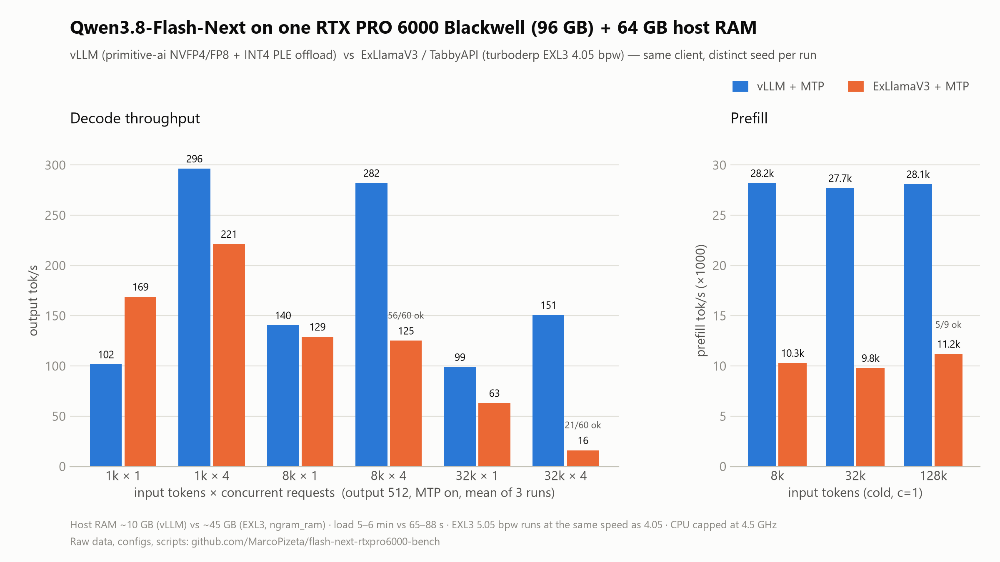
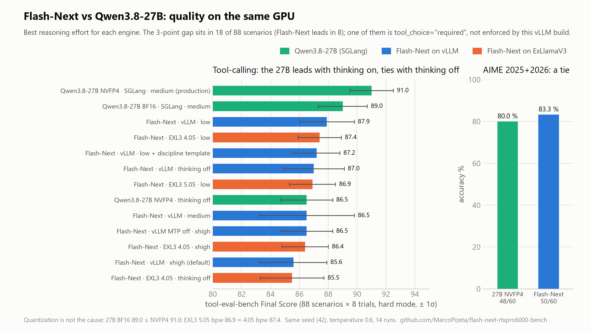

# Qwen3.8-Flash-Next on a single RTX PRO 6000 Blackwell (96 GB) with 64 GB host RAM: vLLM (NVFP4/FP8 + INT4 PLE offload) vs ExLlamaV3 (EXL3) — and vs Qwen3.8-27B as the incumbent

Independent, reproducible benchmark of the two ways to serve **Qwen3.8-Flash-Next** (125B-A6B + 51B n-gram/PLE table) on one workstation GPU with only **64 GB of host RAM**, run 04–05 September 2026. Everything needed to reproduce is in this repo: raw client JSON, tool-eval reports, engine configs, scripts, hardware snapshot, orchestrator logs.

**v2 (05/09/2026)** extends the night run with: reasoning-effort sweep, a head-to-head against the model this machine actually serves in production (**Qwen3.8-27B NVFP4 on SGLang**), per-scenario diff, a `tool_choice="required"` investigation, context-pressure sweep, 32k × 8/16 concurrency, prefix-cache latency, GPU energy, 27B BF16 vs NVFP4, EXL3 5.05 vs 4.05 bpw, a "tool discipline" chat template, AIME 2025+2026, and a small in-house A/B on real workloads (protocol and counts only).

**TL;DR**
* **Flash-Next engine choice on this box**: vLLM + `primitive-ai/Qwen3.8-Flash-Next-mixed-NVFP4-FP8` + INT4 PLE offload + MTP. Faster from 8k context up and at any concurrency > 1, 2.7× faster prefill, stable at 32k × 4/8/16, ~10–12 GB host RAM. ExLlamaV3/TabbyAPI (`turboderp/Qwen3.8-Flash-Next-exl3`) wins only short single-user chat (169–173 tok/s at 1k), loads in 1–1.5 min instead of 5–6, needs ~45 GB host RAM and completes only 21/60 requests at 32k × 4, 2/16 at 32k × 8.
* **Flash-Next vs Qwen3.8-27B (the incumbent)**: on tool-calling (tool-eval-bench, best effort each) the 27B scores **91.0 ± 1.5** vs Flash-Next **87.9 ± 1.9** (vLLM, `reasoning_effort=low`); the gap is concentrated in a handful of scenarios, one of which (`tool_choice="required"`) is a vLLM/xgrammar enforcement problem rather than model quality. On AIME 2025+2026 they are equal (48/60 vs 50/60). On a 19-case in-house A/B (Italian RAG, delivery-note photos, quality-management drafting) they are equivalent, Flash-Next ~2× faster. **Quantization is not the cause**: 27B BF16 scores 89.0 (≤ NVFP4 91.0), EXL3 5.05 bpw 86.9 ≈ 4.05 bpw 87.4.
* Why the 27B stays in production here anyway: KV capacity (1.27M tokens fp8 vs 217k), `required` enforced 8/8, 2-minute restart vs 5–6, and no Flash-Next checkpoint with calibrated KV scales yet.





*Figures regenerated from the numbers in this README by `scripts/make-figures.py`.*

---

## Hardware & software

| | |
|---|---|
| GPU | NVIDIA RTX PRO 6000 Blackwell Workstation Edition, 96 GB (97,887 MiB), 600 W, driver 595.84, PCIe 5.0 x16 |
| CPU | AMD Ryzen Threadripper 9960X (24C/48T), **max clock capped to 4.5 GHz for every run from `v3` onward** (see *Caveats*) |
| RAM | 64 GB DDR5-4800 ECC RDIMM (2 × 32 GB, dual channel) — 60.9 GiB usable |
| Storage | Samsung 990 PRO 1 TB NVMe (models + HF cache) |
| OS | Ubuntu 26.04.1 LTS, kernel 7.0.0-30, Docker 29.7.2 |
| vLLM | `vllm/vllm-openai:qwen38-flash-next` @ `sha256:fc120ece…` (built 26/08/2026), vLLM `0.1.dev20073+g8e685d198`, torch 2.13.0+cu130 — the dedicated image the official recipe still requires as of 05/09/2026 |
| ExLlamaV3 | `ghcr.io/theroyallab/tabbyapi:cu13` @ `sha256:90a01932…` (built 03/09/2026), ExLlamaV3 **1.4.6**, torch 2.11 cu130 — rebuilt as `tabbyapi:cu13-pizeta` with `python3-dev` added (see *Fixes*) |
| SGLang (27B reference) | `lmsysorg/sglang:dev-cu13`, `RadixArk/Qwen3.8-27B-NVFP4-BF16-LMHead`, KV `fp8_e4m3`, NEXTN speculative (steps 2), `--max-running-requests 8` — the production config of this machine ([`configs/sglang-27b-nvfp4-production.sh`](configs/sglang-27b-nvfp4-production.sh)); BF16 variant `Qwen/Qwen3.8-27B` with KV bf16 ([`configs/run-sglang-27b-bf16.sh`](configs/run-sglang-27b-bf16.sh)) |
| Client | `python3 -m sglang.benchmark.serving --backend vllm-chat` from `lmsysorg/sglang:dev-cu13` (same client, same `/v1/chat/completions` endpoint for every engine) |
| Quality | `tool-eval-bench 2.6.1.dev42+g6a98f0324` (`run --seed 42 --trials 8 --hardmode --temperature 0.6 --timeout 600`, plus `--context-pressure-sweep`) |
| Checkpoints | `primitive-ai/Qwen3.8-Flash-Next-mixed-NVFP4-FP8` rev `adf14c6b` (172 GiB incl. INT4 PLE table) · `turboderp/Qwen3.8-Flash-Next-exl3` branches `4.05bpw_h6_ng6` (101 GiB) and `5.05bpw_h6_ng6` (115 GiB) |

Full snapshot: [`HARDWARE.md`](HARDWARE.md). Background load during the runs: Prometheus/Grafana/cAdvisor/node-exporter, two idle OCR containers, Open WebUI (idle).

## Engine configurations

**vLLM** ([`configs/vllm-flash-next.sh`](configs/vllm-flash-next.sh)): primitive-ai's 3-file PLE-quant overlay (`worker.py`, `ple_layer.py`, `connector.py`) mounted over `/usr/local/lib/python3.12/dist-packages/vllm`, `VLLM_PLE_QUANT_DIR=/ples_int4`, `VLLM_PLE_CPU_OFFLOAD=1`, `VLLM_GDN_DECODE_KERNEL=triton`, `--distributed-executor-backend mp --gpu-memory-utilization 0.92 --max-num-seqs 64 --max-model-len 135168 --enable-auto-tool-choice --tool-call-parser qwen3_coder --reasoning-parser qwen3`. MTP: `--speculative-config '{"method":"mtp","num_speculative_tokens":3}'`. Resulting KV cache: **503k tokens without MTP, 217k with MTP**.

**ExLlamaV3 / TabbyAPI** ([`configs/tabby-flash-next.sh`](configs/tabby-flash-next.sh), [`configs/tabby-config.yml`](configs/tabby-config.yml)): `backend: exllamav3`, `max_seq_len: 262144`, `cache_size: 262144` (131072 for the 5.05 bpw run), `cache_mode: FP16`, `chunk_size: 4096`, `gpu_split_auto: true`, `vision: true`, **`ngram_ram: true`** (the 36 GiB 6-bit n-gram table lives in host RAM), `tool_format: qwen3_coder`, `reasoning: true`. MTP: `draft_model: draft_mode: mtp` vs `disabled`.

**Reasoning effort.** The Qwen3.8 chat template (27B and Flash-Next) accepts `reasoning_effort` ∈ {`xhigh` (default), `medium`, `low`}. vLLM and TabbyAPI take it through `chat_template_kwargs`; for the 27B in production the template default is patched to `medium` ([`configs/chat-template-38-medium.jinja`](configs/chat-template-38-medium.jinja)). Speed matrices use `enable_thinking: false`, temperature 0.6, top_p 0.95.

## Method

* **Speed matrix** ([`scripts/bench-matrix-v2.sh`](scripts/bench-matrix-v2.sh)): random dataset, input {1k, 8k, 32k} × output 512 × concurrency {1, 4} × 3 runs, 6 prompts at c=1 / 20 at c=4, 2 warm-up requests. **A distinct `--seed` per (input, concurrency, run)** so no run can hit the prefix cache of a previous one (same seeds for every engine → identical prompt sets).
* **Prefill** ([`scripts/bench-prefill-v2.sh`](scripts/bench-prefill-v2.sh)): input {8k, 32k, 128k} × output 1 × c=1 × 3 runs, **no warm-up**, distinct seed per run → every TTFT is a cold prefill. `prefill tok/s = input / median TTFT`.
* **Concurrency 32k** (`run-extra.sh`): input 32,768 × output 256, c=8 (16 requests) and c=16 (32 requests), one run each, per engine (`results/conc_*.json`).
* **Prefix cache** ([`scripts/prefix-cache-test.py`](scripts/prefix-cache-test.py)): one ~4.7k-token system prompt, 8 different short questions, TTFT of the first (cold) vs the following (warm) requests (`results/prefix_*.json`).
* **Quality**: tool-eval-bench, 88 scenarios × 8 trials, hard mode; thinking on/off and `reasoning_effort` xhigh/medium/low. **Context-pressure sweep**: `--context-pressure-sweep 0.25-1.0 --sweep-steps 4 --context-size 65536`, 2 trials per level (fill 10,340 / 22,748 / 35,156 / 47,564 tokens).
* **Reasoning** ([`eval/reasoning-eval.py`](eval/reasoning-eval.py)): AIME 2025 (30) + AIME 2026 (30) from the `math-ai/aime25` and `math-ai/aime26` datasets, temperature 1.0, top_p 0.95, top_k 20, `max_tokens` 32,768, `reasoning_effort=xhigh`, 4 concurrent, exact match on `\boxed{}`; a response cut at 32k counts as wrong. Per-problem results (without problem text) in `eval/aime_*.jsonl`.
* **Energy**: GPU power sampled every 5 s (`nvidia-smi`, `results/power-log.csv`) and integrated per phase by [`scripts/energy.py`](scripts/energy.py) → [`results/energy.md`](results/energy.md); the v3 matrix uses the 10 s `mem_*.csv` samples.
* **Host memory**: sampled every 10 s ([`scripts/mem-monitor.sh`](scripts/mem-monitor.sh) → `results/mem_*.csv`).
* Orchestrated unattended by `run-all.sh` (quality), `run-matrix-v3.sh` (speed), and the 05/09 chains `run-effort.sh`, `run-27b-nothink.sh`, `run-extra.sh`, `run-exl3-5bpw.sh`, `run-decide.sh`, `run-discipline.sh`; logs in [`logs/`](logs/). Each chain stops the engine before it and waits for the next to be ready (`scripts/wait-ready.sh`).

## Results — decode throughput (Flash-Next, v3 matrix)

Output tok/s, mean of 3 runs (individual runs in `results/`). TTFT = median ms. `ok` = completed/total requests when not 100 %.

| input × conc | vLLM MTP on | vLLM MTP off | EXL3 4.05 MTP on | EXL3 4.05 MTP off | EXL3 5.05 MTP on |
|---|---|---|---|---|---|
| 1k × 1 | 101.6 (TTFT 259) | 78.1 (295) | **168.9** (283) | 105.3 (247) | 172.8 (298) |
| 1k × 4 | **296.4** (179) | 225.1 (136) | 221.4 (638) | 198.3 (369) | 226.9 (609) |
| 8k × 1 | **140.5** (193) | 95.5 (175) | 129.1 (527) | 79.7 (483) | 116.0 (551) |
| 8k × 4 | **282.1** (368) | 212.7 (311) | 125.2 (1466) · ok 56/60 | 139.5 (1205) · ok 59/60 | 133.4 (1708) · ok 58/60 |
| 32k × 1 | **98.9** (956) | 76.7 (912) | 63.1 (2643) | 50.6 (2622) | 61.2 (2726) |
| 32k × 4 | **150.7** (1412) | 135.4 (1294) | 16.1 (5270) · **ok 21/60** | 15.8 (4954) · **ok 21/60** | 15.9 (5020) · **ok 21/60** |

Median TPOT at c=1 with MTP: EXL3 **5.5 ms** vs vLLM **6.1 ms** — ExLlamaV3's pure decode step is faster; it loses on prefill and on scaling. MTP is worth **+30 %** on vLLM and **+60 %** on EXL3 at c=1. At 32k × 4 TabbyAPI completed 21 of 60 requests in every configuration (server logs `Request disconnected`, the client receives a non-JSON SSE chunk) — a TabbyAPI/ExLlamaV3 limit on concurrent long-prompt ingestion, not an MTP or bpw issue. **5.05 bpw runs at the same speed as 4.05 bpw** (`results/tabby5_*.json`, `results/prefill_tabby5_*.json`).

For reference, the 27B NVFP4 on SGLang decodes at ~98 tok/s at 8k × 1 on this GPU (production config, NEXTN steps 2).

## Results — prefill (Flash-Next)

Cold prefill, output 1, c=1, 3 runs (individual TTFTs in the last column).

| config | 8k | 32k | 128k (131,072) |
|---|---|---|---|
| vLLM MTP on | 290 ms → **28.2k tok/s** (213/340/290) | 1181 ms → **27.7k** (861/1423/1181) | 4662 ms → **28.1k** (6592/4662/4411) |
| vLLM MTP off | 277 ms → **29.6k** (188/304/277) | 1134 ms → **28.9k** (825/1372/1134) | 4426 ms → **29.6k** (6351/4426/4234) |
| EXL3 MTP on | 794 ms → **10.3k** (651/1010/794) | 3353 ms → **9.8k** (2563/4026/3353) | 11666 ms → **11.2k** (11666/12052/11351) · completed 1/3, 2/3, 2/3 |
| EXL3 MTP off | 772 ms → **10.6k** (633/963/772) | 3214 ms → **10.2k** (2461/3892/3214) | 11316 ms → **11.6k** (11316/11677/11002) · completed 1/3, 2/3, 2/3 |

vLLM prefills **~2.7× faster** and flat from 8k to 128k. At 128k only 5 of the 9 EXL3 requests per config completed (per run: 1/3, 2/3, 2/3 — `completed` field in `results/prefill_tabby_*_in131072_r*.json`); the failures are the same non-JSON-chunk error seen at 32k × 4. The 128k medians are computed on the completed requests only.

## Results — concurrency at 32k input (Flash-Next vs 27B)

Input 32,768 × output 256, thinking off, one run per point (`results/conc_*.json`).

| | 27B NVFP4 / SGLang | Flash-Next vLLM MTP on | Flash-Next EXL3 4.05 MTP on |
|---|---|---|---|
| c=8 (16 requests) | **16/16**, 65.0 tok/s, TTFT med **5.0 s**, TPOT 88 ms | **16/16**, 46.9 tok/s, TTFT med 12.8 s, TPOT 71 ms | 2/16 completed |
| c=16 (32 requests) | **32/32**, 62.6 tok/s, TTFT med 17.1 s (p99 30 s), TPOT 98 ms | **32/32**, 68.2 tok/s, TTFT med 20.6 s (p99 28 s), TPOT 53 ms | 3/32 completed |

The 27B's production config caps `--max-running-requests 8`, so at c=16 half the requests queue (hence the 17 s TTFT); vLLM runs 16 concurrently but with `--max-model-len 135168` and a 217k-token KV pool it is admission-limited to ~6 sequences of 32k, so its TTFT also climbs. Both serve every request; ExLlamaV3 does not.

## Results — prefix-cache latency

~4.7k-token identical system prompt, 8 different questions, TTFT in ms (`results/prefix_*.json`).

| | cold (first request) | warm median | warm min |
|---|---|---|---|
| 27B NVFP4 / SGLang (RadixAttention) | 161 | **84** | 83 |
| Flash-Next vLLM MTP on — fresh process | 6529 | 270 | 250 |
| Flash-Next vLLM MTP on — warm process (after the AIME run) | 2375 | 238 | 233 |
| Flash-Next EXL3 4.05 MTP on | 6388 | 820 | 818 |

The 6.4–6.5 s "cold" figures for Flash-Next are first-request costs of a freshly started engine (kernel/graph warm-up), not the prefill of 4.7k tokens; on a warm process the true cold prefill is 2.4 s for vLLM. Prefix hits work on all three engines; the 27B answers 3× faster than vLLM Flash-Next and 10× faster than EXL3 on a warm prefix.

## Results — tool-calling quality (tool-eval-bench)

88 scenarios × 8 trials, hard mode, seed 42, temperature 0.6. Error rate 0.0 in every run. Reports (summary + per-trial traces) in [`runs/`](runs/).

### Flash-Next: engine × thinking × reasoning effort

| engine | thinking / effort | Final Score | Pass@8 | Pass^8 | notes |
|---|---|---|---|---|---|
| vLLM MTP on | on, xhigh (default) | 85.6 ± 2.3 | 93.2 % | 63.6 % | 33 `xgrammar Failed to advance FSM` server-log errors ² |
| vLLM MTP on | on, medium | 86.5 ± 3.3 | 92.0 % | 61.4 % | |
| vLLM MTP on | **on, low** | **87.9 ± 1.9** | 89.8 % | 68.2 % | best Flash-Next setting on vLLM |
| vLLM MTP on | off | 87.0 ± 2.1 | 92.0 % | 56.8 % | |
| vLLM MTP **off** | on, xhigh | 86.5 ± 1.8 | 92.0 % | 63.6 % | **0 xgrammar errors / 2093 requests** |
| vLLM MTP on, "discipline" template ³ | on, low | 87.2 ± 1.6 | 93.2 % | 69.3 % | |
| EXL3 4.05 MTP on | on, xhigh | 86.4 ± 1.6 | 88.6 % | 67.0 % | |
| EXL3 4.05 MTP on | **on, low** | **87.4 ± 1.5** | 87.5 % | 71.6 % | best EXL3 setting |
| EXL3 4.05 MTP on | off | 85.5 ± 2.2 | 89.8 % | 60.2 % | |
| EXL3 **5.05** MTP on | on, low | 86.9 ± 1.6 | 85.2 % | 69.3 % | same as 4.05 within noise |

All Flash-Next runs sit between 85.5 and 87.9; `low` is the best effort on both engines (+2.3 over the xhigh default on vLLM), thinking off is close behind. MiaAI's published references (NVFP4 85.4 ± 2.0, EXL3 85/88) are reproduced.

### The incumbent: Qwen3.8-27B on SGLang

| model / engine | thinking / effort | Final Score | Pass@8 | Pass^8 |
|---|---|---|---|---|
| 27B **NVFP4** (RadixArk), KV fp8, NEXTN 2 — production | **on, medium** | **91.0 ± 1.5** | 96.6 % | 72.7 % |
| 27B NVFP4 — same | off | 86.5 ± 1.8 | 89.8 % | 62.5 % |
| 27B **BF16** (`Qwen/Qwen3.8-27B`), KV bf16, NEXTN 2 | on, medium | 89.0 ± 1.7 | 92.0 % | 71.6 % |

The 27B with thinking beats every Flash-Next configuration by ~3 points; **with thinking off the two models are equal** (86.5 vs 87.0). The BF16 original does not score higher than the NVFP4 checkpoint, so the 27B's advantage is not a quantization artefact — and neither is Flash-Next's deficit (5.05 vs 4.05 bpw, INT4 vs 6-bit PLE table, all within 1σ).

### Where the 3 points are: per-scenario diff (27B medium vs Flash-Next vLLM low)

Scenarios passed out of 8 trials; 62 of 88 scenarios are identical.

| scenario | 27B | Flash | | scenario | 27B | Flash |
|---|---|---|---|---|---|---|
| TC-45 (`tool_choice="required"`) | **8** | **0** | | TC-46 | 0 | **6** |
| TC-80 | 7 | 0 | | TC-68 | 4 | **8** |
| TC-85 | 3 | 0 | | TC-88 | 2 | **7** |
| TC-55 | 8 | 3 | | TC-74 | 2 | **6** |
| TC-49 | 6 | 3 | | TC-35 | 6 | 8 |
| TC-43 | 8 | 6 | | TC-52 | 6 | 7 |
| TC-14, TC-50, TC-51, TC-57 | 1–2 | 0 | | TC-48, TC-53 | 7, 1 | 8, 2 |
| TC-03, TC-21, TC-38, TC-54, TC-60, TC-62, TC-81, TC-84 | −1 each | | | | | |

27B ahead in 18 scenarios, Flash-Next in 8. Flash-Next's four zeros (TC-45, TC-50, TC-57, TC-80/85) are the same across xhigh/medium/low and the discipline template; the "discipline" template moved the 8 critical scenarios from 40.9 (8-scenario subset) by nothing measurable — **prompting is not the lever**, see the next section. Against itself, the 27B loses 21 scenarios and gains 6 when thinking is turned off (86.5), so on this benchmark the 27B's edge is mostly *thinking* quality, which Flash-Next at `low` does not match.

² The MTP-on xgrammar count was read live from the container log and is recorded in [`logs/xgrammar-observations.md`](logs/xgrammar-observations.md); the container log itself was not preserved. The MTP-off count (0 / 2093) is in the v3 orchestrator log.
³ [`configs/chat_template_flash_discipline.jinja`](configs/chat_template_flash_discipline.jinja): the stock template with `reasoning_effort` default `low` and a "# Tool discipline" paragraph injected into the tools block (call a tool when one applies, never answer from memory, read before write, act once, ask when a parameter is missing). Launched with [`configs/vllm-flash-next-discipline.sh`](configs/vllm-flash-next-discipline.sh).

### `tool_choice="required"` is not reliably enforced on this vLLM build

TC-45 is the only tool-eval scenario that sends `tool_choice: "required"`. Flash-Next on vLLM fails it 0/8 in every run; the 27B on SGLang passes 8/8; TabbyAPI does not implement `required` at all. A minimal replication against the vLLM server (12 tool definitions, `stream: true`, `parallel_tool_calls: true`, temperature 0.6, "What is 7 times 8?"):

| | run 0 | run 1 | run 2 |
|---|---|---|---|
| `enable_thinking: false`, streaming | `finish=stop`, **no tool call**, "7 × 8 = **56**" | `tool_calls=[calculator]` | `finish=stop`, **no tool call**, "56" |
| `enable_thinking: true`, streaming | `tool_calls=[calculator]` | `tool_calls=[calculator]` | `tool_calls=[calculator]` |
| non-streaming, either | `tool_calls=[calculator]` | | |

With thinking on the constraint holds but the server logs `xgrammar … Failed to advance FSM … for tokens 271` (`\n\n`) / `71093` (` ``` `) and `matcher has terminated after accepting the stop token, but is trying to accept new token with id 198`; with MTP off these messages disappear (0 in 2093 requests) but TC-45 still fails. With only 2 tools defined the constraint held in every mode. This looks like a structured-output / reasoning-parser interaction in the streaming path (compare vllm-project/vllm issues #18819 and #39130) rather than a model property; reported as [vllm-project/vllm#55552](https://github.com/vllm-project/vllm/issues/55552). **Practical consequence**: agents that rely on `required` to force a call should not be moved to Flash-Next on this stack yet.

### Context-pressure sweep (65,536-token window, 2 trials per level)

Pass rate of the tool-eval scenario set with the context pre-filled to 25/50/75/100 % of 65,536 tokens.

| fill tokens | 10,340 | 22,748 | 35,156 | 47,564 |
|---|---|---|---|---|
| 27B NVFP4 medium | 85.2 % | 81.8 % | 83.0 % | 87.5 % |
| Flash-Next vLLM low | 80.7 % | 81.8 % | 76.1 % | 79.5 % |

No breaking point for either model up to 48k of filler; the 27B keeps a 2–7 point lead, consistent with the un-pressured scores. (2 trials per level: treat differences under ~4 points as noise.)

## Results — reasoning (AIME 2025 + 2026, `reasoning_effort=xhigh`)

| | correct / 60 | AIME 2025 | AIME 2026 | cut at 32k tokens | mean completion tokens | wall time (c=4) |
|---|---|---|---|---|---|---|
| 27B NVFP4 / SGLang | 48 (80.0 %) | 24/30 | 24/30 | 18 | 16,637 | 3 h 02 min |
| Flash-Next vLLM MTP on | **50 (83.3 %)** | 24/30 | 26/30 | 12 | 15,892 | 2 h 46 min |

Equal within noise (2 problems). Every miss of both models is a response that hit the 32k `max_tokens` limit (18 vs 12): with a larger budget both would score higher. Per-problem records (id, gold, prediction, finish reason, usage, seconds) in `eval/aime_*.jsonl`.

## Results — energy

GPU only, from `results/power-log.csv` (5 s) and `mem_*.csv` (10 s); includes load, warm-up and idle gaps between requests, so per-task figures are what the machine actually spent. Idle: 27B with `--sleep-on-idle` **12 W**, Flash-Next vLLM **13.7 W** (CPU 99.6 % idle — the PLE offload worker's busy loop only spins under load).

| task | engine | duration | mean W | **Wh** |
|---|---|---|---|---|
| v3 speed matrix (per config, incl. load) | vLLM MTP on / off | 43 / 46 min | 188 / 190 | 134 / 144 → **2.14 / 2.30 Wh per 1k output tokens** |
| | EXL3 MTP on / off | 54 / 56 min | 260 / 264 | 235 / 246 → **4.92 / 5.03 Wh per 1k output tokens** |
| tool-eval 88 × 8 | Flash-Next vLLM, low | 38 min | 414 | **262** |
| | 27B NVFP4, thinking off | 32 min | 485 | **256** |
| | 27B **BF16**, medium | 104 min | 534 | **920** |
| context-pressure sweep | 27B NVFP4 medium | 51 min | 528 | 442 |
| | Flash-Next vLLM low | 31 min | 483 | 251 |

Flash-Next on vLLM does the same tool-eval work as the 27B thinking-off for the same energy, and the sweep for 57 % of the 27B's energy; ExLlamaV3 costs ~2.3× vLLM per output token. Full per-phase table in [`results/energy.md`](results/energy.md).

## Results — a small in-house A/B on real workloads (protocol only)

19 cases from this machine's actual jobs, same request to both models (27B on SGLang, Flash-Next on vLLM MTP, both `reasoning_effort=medium`; the 6 document extractions with thinking off), same retrieval context for the RAG cases: 10 Italian RAG questions on internal quality/safety procedures, 6 real supplier delivery-note photos → JSON extraction, 3 quality-management drafting tasks (8D, incoming-material non-conformity, expired calibration). **Inputs and outputs are not published** (internal documents). Judged by Claude with the source photos as ground truth (a blind human judgment is pending):

| | Flash-Next better | 27B better | tie |
|---|---|---|---|
| RAG (10) | 3 (+1 marginal) | 0 | 6 |
| document extraction (6) | 1 | 2 | 3 |
| QM drafting (3) | 0 | 1 marginal | 2 |
| **total (19)** | **4–5** | **3** | **11–12** |

Flash-Next was ~2× faster on every case. Failure modes differ: the 27B mis-read thousands separators in 2 of 6 documents (`1.008` for 1,008 kg), Flash-Next mis-read strings (a supplier name, a unit) in 2 of 6 and in one 8D draft invented verification results that had not been performed. On these workloads the tool-eval gap does not show.

## Fixes needed to get here (all in this repo)

1. **`vm.overcommit_memory=1`** on the host. The PLE-quant overlay builds the model with the full BF16 n-gram table first (`torch.empty` of 102 GB, virtual) and only afterwards swaps in the INT4 table; with the default heuristic overcommit the kernel refuses any allocation > RAM+swap (67 GB) → `PleOffloadWorker … DefaultCPUAllocator: can't allocate memory`.
2. **`--max-num-seqs 64`** for vLLM: the default 1024 exceeds the 596 available Mamba cache blocks and CUDA graph capture aborts (`Engine core initialization failed`). **Not MTP-specific**: re-tested on 06/09/2026 with MTP off and `--max-model-len` at the image default (262,144) → same failure, same 596 blocks, with 11.26 GiB / 463,613 tokens of KV available at 0.92 utilization ([`logs/test-mtp-off-default-max-num-seqs-20260906.log`](logs/test-mtp-off-default-max-num-seqs-20260906.log)). The block count is fixed by the GDN state layout at this utilization, not by the draft head.
3. **`--max-model-len 135168`** for vLLM with MTP: at 262,144 the KV cache needed (7.57 GiB) exceeds what is left after the draft head (6.98 GiB).
4. **TabbyAPI image lacks `Python.h`**: Triton cannot JIT-compile `cuda_utils` for ExLlamaV3's GDN kernel. [`configs/Dockerfile.tabby`](configs/Dockerfile.tabby) adds `python3-dev`.
5. **Prefix cache contamination**: `sglang.benchmark.serving` uses a fixed `--seed 42` and warms up with the first prompt, so repeated runs hit the prefix cache in both engines (TTFT of 90 ms for 131k tokens). The `v1` results in [`results-v1-seed42/`](results-v1-seed42/) are kept for transparency; **only `results/` (v3, distinct seeds) should be quoted**.
6. **CPU thermals**: the three busy cores of the PLE offload worker boosted to 5.4 GHz and pushed Tctl to 95 °C on an air cooler; capping `scaling_max_freq` at 4.5 GHz brought it to 61 °C under load (systemd unit not included — site-specific).

## Caveats (read before quoting)

* **CPU capped at 4.5 GHz** for every run from `v3` onward (all 05/09 runs included). Cost ≈16 % single-thread clock; may slightly penalise vLLM's Python-side path.
* **Different max context**: vLLM 135,168 vs TabbyAPI 262,144 (131,072 for the 5.05 bpw run) vs SGLang 27B 262,144. Does not affect the measured points but does affect capacity: the 27B holds a 1.27M-token fp8 KV pool, Flash-Next on vLLM 217k (MTP) / 503k.
* The 04/09 tool-eval runs used the template default `reasoning_effort` (**xhigh**); the 05/09 effort sweep is the fair comparison. The 27B "production" numbers use its patched `medium` default.
* The context-pressure sweep has 2 trials per level, the concurrency test one run per point, the prefix test 8 requests: indicative, not statistics.
* The in-house A/B ran at `medium` for both models (it was queued before the effort sweep finished and showed `low` as Flash-Next's best), and was judged by an LLM, not blind by a human.
* The speed matrix keeps 2 warm-up requests on the first prompt: 1 of 6–20 requests per run has an understated TTFT; medians are unaffected.
* tool-eval-bench mislabels the backends in its reports: TabbyAPI shows as "llamacpp / llama.cpp" (unrecognised server), vLLM's quantization as "FP8" (the checkpoint is mixed NVFP4-FP8).
* Single machine, 3 runs per matrix point. Treat differences under ~10 % (speed) / 1σ (quality) as noise.
* Not tested: SGLang for Flash-Next (its checkpoints dequantize the n-gram table to ~100 GB BF16 in host RAM — does not fit in 64 GB), llama.cpp (MTP still WIP at the time), the official `Qwen/Qwen3.8-Flash-Next-FP8` (172.8 GiB — does not fit with 96 + 64 GB), `nvidia/Qwen3.8-Flash-Next-NVFP4` (no calibrated KV scales at the time; deferred to a later revision).

## What would make Flash-Next the production model on this hardware

Any of: (1) a checkpoint with **calibrated FP8 KV scales** (today `kv_cache_quant_algo: null` everywhere — KV fp8 without scales is unsafe on SM120), which would triple the KV pool; (2) a calibrated NVFP4 checkpoint loadable in vLLM; (3) a vLLM build where `tool_choice="required"` is enforced in streaming and MTP + thinking produce no xgrammar errors; (4) 128 GB of host RAM (an un-quantized PLE table, or SGLang). Until then the 27B stays.

## Layout

```
HARDWARE.md                 hardware/software snapshot taken at run start
results/                    v3 raw client JSON (matrix + prefill, 4.05 and 5.05 bpw), conc_* (32k × 8/16), prefix_*,
                            host memory CSV, power-log.csv, energy.md — the numbers above
                            (the `generated_texts` field — model output to random-token prompts — replaced by a placeholder)
results-v1-seed42/          v1 raw JSON (fixed seed, prefix-cache contaminated) — for transparency only
runs/                       tool-eval-bench summaries + per-trial reports (14 runs + 2 context-pressure sweeps)
eval/                       reasoning-eval.py (AIME) + per-problem results for both models (no problem text)
configs/                    engine launch scripts (vLLM, TabbyAPI, SGLang 27B NVFP4 production and BF16), TabbyAPI config,
                            chat templates (27B medium default, Flash-Next "discipline"), Dockerfile for the python3-dev fix
scripts/                    matrix / prefill / readiness / memory-monitor / prefix-cache / energy scripts + make-figures.py
docs/                       speed.png, quality.png (the two figures above)
run-*.sh                    unattended orchestrators (Telegram notify calls are site-specific, harmless if absent)
logs/                       orchestrator logs (04/09 night, 05/09 chains) + xgrammar-observations.md
PLE-QUANT-README-primitive-ai.md  the overlay's README as downloaded (credit: primitive-ai)
```

## Credits

Checkpoints and overlay by **primitive-ai**, **turboderp** and **RadixArk**; quality protocol and reference numbers by **MiaAI** (tool-eval-bench); AIME sets by **math-ai**. Benchmark run and written up by Marco Zerbato with Claude. Issues and corrections welcome.
